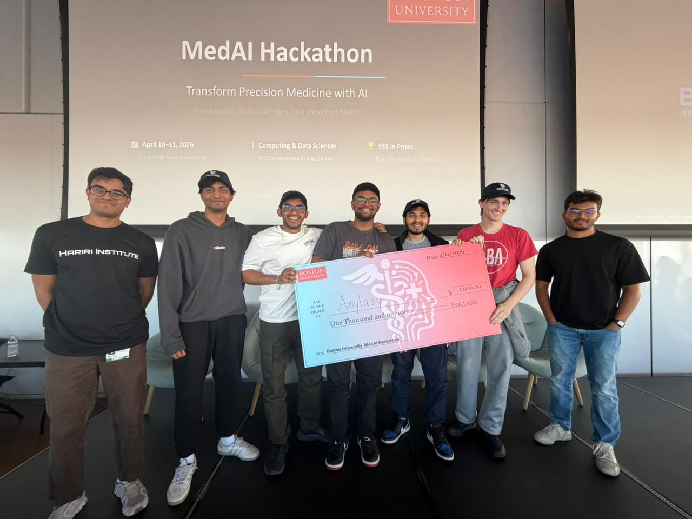

## A Two-Day Sprint at the Intersection of AI and Biomedicine

Boston University hosted a MedAI Hackathon, supported by leading BU centers and departments that advance biomedical AI and health data science. The two-day event, from April 10 to 11, began with onboarding, team formation, connecting with mentors, and setting up development environments. On day two, teams built solutions to faculty-sourced biomedical AI challenges, and the top projects were recognized during the awards ceremony.

The hackathon was about three faculty-led tracks that drew on de-identified research data. Teams had to build models under hackathon constraints.

---

## The Challenge Landscape

**Track 1 - Early-stage lung cancer phenotyping**
Using H&E whole-slide images from lung resections and biopsies, teams modeled subtle histology patterns linked to vascular invasion and aggressive growth.

**Track 2 - Amyloid PET for Alzheimer’s disease**
Participants worked with 3D amyloid PET scans and tracer labels to predict standardized Centiloid burden.

**Track 3 - Acute tubular injury from proteomics**
From pre-biopsy SomaScan protein profiles and clinical covariates in the Boston Kidney Biopsy Cohort, teams predicted acute tubular injury.

---


## Team 14 - AmyLazy

[Debesh Biswas](https://www.linkedin.com/in/debesh0611),
[Hilton Raj](https://www.linkedin.com/in/hiltonraj),
[Vishnuram AV](https://www.linkedin.com/in/vishnuram-av-6306b029a/),
[Manak Jain](https://www.linkedin.com/in/manakjain), and
[William Duralia](https://www.linkedin.com/in/william-duralia/).

### Initial Approach

We began by exploring all three tracks in parallel. While William focused on deeper dataset analysis and literature review, the rest of the team experimented with model architectures and quick feature engineering across each dataset. Vishnuram worked on APBET, Hilton worked on BKBC, and me and Manak worked VI-LUAD on By midday, we had working prototypes for all three tracks, though they were still rough and exploratory.

### Strategic Pivot

Despite early progress across all tracks, hackathon constraints forced a critical decision. With access to only a single GPU per team and limited AI tokens, continuing across all three problems would dilute our efforts.

We decided to concentrate entirely on Track 3 or - BKBC, the proteomics challenge, where we saw the strongest potential for meaningful signal extraction and rapid iteration.

---


## Feature Engineering

One of the important aspects of medical datasets is that they are highly detailed and rich in features, making feature engineering essential. However, going in blindly without domain understanding would likely have led to suboptimal results, given the complexity and clinical nuance inherent in medical data.

And the four of us, having no experience in the biomedical field, Williams' insights led to an array of essential features in engineering, which were ultimately beneficial.

Diving deeper into our input data, we had:

* **Protein features:** thousands of SomaScan aptamer measurements
* **Clinical features:** age, sex, baseline_egfr (3 features)
* **Target:** binary ATI label (0 = No ATI, 1 = ATI)

We ultimately converged on a set of eight carefully chosen feature engineering and preprocessing steps, each designed to handle the quirks of clinical proteomics data rather than fight against them.

To begin with, we treated missing data not as a nuisance, but as a signal. Before performing any imputation, we quantified missingness at a sample level. In clinical proteomics, missing values are rarely random, they often reflect underlying factors such as disease severity or sample quality. By capturing this information, we allowed the model to learn from patterns of absence. For imputation, we used a median strategy. Protein and clinical features were filled with their respective medians, ensuring stability against extreme values. However, for clinical variables, we went a step further by introducing binary missingness flags. This preserved the information that a value was originally absent, enabling the model to distinguish between “true” measurements and imputed ones.

Given the noisy nature of SomaScan measurements, outliers posed a significant challenge. To mitigate their impact, we applied winsorisation, clipping each protein’s values to a defined percentile range. This prevented a small number of extreme observations—whether due to assay noise or rare biological events—from disproportionately influencing the feature distribution. We also applied a variance filter early in the pipeline. Among the thousands of aptamers, many exhibited little to no variation across samples and therefore carried minimal discriminative value. Removing these features not only reduced noise but also improved computational efficiency for all subsequent steps.

Normalization was handled using a RobustScaler rather than standard z-scoring. By centering and scaling features based on the median and interquartile range, this approach provided resilience against outliers and better reflected the underlying distribution of real-world clinical data. Even after filtering, the dimensionality of the proteomic data remained extremely high. To address this, we employed Truncated Singular Value Decomposition (SVD), projecting the data onto a lower-dimensional space defined by its principal axes of variation. This effectively captured the dominant patterns of protein co-expression while making the feature space more tractable for modeling.

On the clinical side, we moved beyond raw inputs and introduced targeted feature engineering. Variables such as age and eGFR were transformed to better reflect their nonlinear relationships with acute kidney injury risk. This included binning age, applying a logarithmic transformation to eGFR, and incorporating interaction and polynomial terms to capture more complex dependencies. Finally, we applied SelectKBest with mutual information as a feature selection step. Rather than relying on linear correlation, mutual information allowed us to capture nonlinear relationships between features and the target variable. By retaining only the most informative features, we ensured that the model trained on signals that were genuinely predictive of ATI risk, rather than noise.

Taken together, these steps formed a pipeline that was not only technically sound but also grounded in the realities of clinical data—messy, high-dimensional, and rich with hidden structure.

---


## The Leaderboard Race Begins

One of the most energizing aspects of the hackathon (apart from the good food and soda) was the live leaderboard for each track, displayed on the big projector. It was not just to keep track of rankings but also a source of motivation and proof of whether an implementation is going in the right direction or not. Teams would frequently glance up to check their standing, celebrate small jumps, or feel the pressure when others overtook them. This transformed the atmosphere, pushing everyone to iterate faster, refine their ideas, and stay fully engaged.

The leaderboard scores were based on testing the submitted model on 30% of unseen data. Which later would become 100% for the final scores - a thing we’ll get to soon.

---


## Technical Architecture 

Moving to implementation, we went for a soft-voting ensemble of three models. Now, why ensemble? We saw that single models struggled with overfitting in high-dim space. We tested three models individually and saw that they each captured different representations and signals. 

* **Tree-based:** Non-linear interactions, feature importance
* **Linear:** Interpretable baseline, regularization via simplicity
* **Neural:** Non-linear representations with learned structure

Followed by soft voting (weighted by validation performance), outperformed any single component.

Our Ensemble Weights were:

* **LightGBM: weight:** 8
* **Logistic Regression:** 2
* **Neural Network:** 1

Diving deeper into the three models,

### LightGBM

Our approach for LightGBM after single model testing was a low learning rate and high *n_estimators*, which  prevents fitting noise. Also *max_depth* and *num_leaves* were kept low to prevent deep tree structures that memorize or overfit. Finally, we had a high feature subsampling to reduce variance, which prevents individual trees from capturing spurious correlations. Balanced class weights were critical when the ATI prevalence is skewed.

```text
Hyperparameters:
    n_estimators: 500
    max_depth: 5
    learning_rate: 0.03
    num_leaves: 20
    min_child_samples: 15
    subsample: 0.8
    subsample_freq: 1
    colsample_bytree: 0.5
    reg_alpha: 0.1 (L1)
    reg_lambda: 1.0 (L2)
    class_weight: "balanced"
```

### Logistic Regression With Elastic Net

After SVD followed by SelectKBest, the feature space is approximately 300 dimensions. So a well-regularized LR is competitive in this regime and very fast. Elastic net combines L1 sparsity with L2 ridge smoothing. Thus, it acts as an interpretable baseline and a regularization constraint on the ensemble.
We also applied Standard Scaler before the training because it is essential for penalty-based methods.

```text
Hyperparameters:
    penalty: "elasticnet"
    solver: "saga"
    C: 0.05
    l1_ratio: 0.5
    max_iter: 3000
    class_weight: "balanced"
```

### Neural Network

```text
Architecture:
    Input dimension: 300 (post-preprocessing)
    Hidden layers: 2 (128 -> 64 units)
    Activation: SeLU (Scaled Exponential Linear Unit)
    Dropout: AlphaDropout (0.6 rate) - preserves SeLU self-normalization properties
    Batch normalization: After each linear layer, before activation
    Output: Sigmoid for binary classification
```

```text
Hyperparameters:
    dropout_rate: 0.6
    learning_rate: 1e-4
    weight_decay: 5e-3
    n_epochs: 500
    batch_size: 32
    patience: 50
    val_fraction: 0.15
    label_smoothing: 0.05
```

```text
Training details:
    Optimizer: AdamW
    Loss function: Binary cross-entropy with label smoothing
    Learning rate schedule: CosineAnnealingLR
    Gradient clipping: norm = 1.0
    Early stopping: based on validation loss with patience=50 epochs
    Train/val split within training fold: stratified 85/15
```

**Why SeLU + AlphaDropout?**

SeLU self-normalizes activations,resulting in mean=0 and variance=1 maintained through layers.  It reduces the need for batch normalization. AlphaDropout preserves these statistics (unlike standard dropout). This is particularly beneficial for small datasets where batch normalization estimates are noisy.

### Cross Validation

We used Stratified K-Fold by the ATI label to maintain class balance in each fold. Each CV iteration gets a completely fresh fitted preprocessor (train only). It prevents feature statistics (SVD, SelectKBest) from leaking information from the test fold.

### Evaluation

We collected predictions for all validation samples across all folds and computed:

* AUC-ROC: Primary CV metric
* Log Loss: Secondary metric
* Per-fold AUC recorded
* Classification report (precision, recall, F1)


### Our Training Results

Our first ensemble run got us into the top 3 of the leaderboard with a log loss of 0.38, and from then on, it was just hyperparameter tuning on different sections, especially the soft voting, and finally, we ended at 4:30pm at the top of the leaderboard with a log loss of 0.31.

It was a short but nerve-racking wait until results were announced. We also won some swag for having the “Laziest Name”, but in the end, we won first place with a log loss of 0.34 (beat second place by a margin of 0.04).

---


## What Matters

Winning in this constraint wasn't about finding the best model. It was about making four deliberate choices that worked together.

### Preprocessing is Where the Real Work Lives

In high-dimensional, low-sample settings, you don't win with architecture. You win with dimensionality reduction. We started with thousands of protein features from SomaScan. That's a lot of potential signal, but mostly noise. The instinct is to let the model figure out which features matter. That's overfitting waiting to happen. Instead, we used SVD to reduce the protein features to 150 components, capturing the main variance structure without memorizing individual sample quirks. Then SelectKBest extracted the top 300 features by F-statistic, giving us a clean, interpretable feature space. 


### Diversity Beat Power

We could have trained a single powerful model. We tried. LightGBM alone got us decent results. A deep neural network, maybe better. But there's a ceiling in constrained settings: no single architecture captures all the signal without overfitting some of it. So we built an ensemble. Not because ensembles are trendy. Because three different models captured three different types of signals. Each model was strong enough to contribute meaningfully, different enough to disagree on different samples. When they agreed, we could trust the prediction.

### Regularization Over Capacity

Every decision we made was about preventing overfitting, not boosting training accuracy. Because if we overfit, then it would result in subpar results on the unseen test dataset. LightGBM used shallow trees, a low learning rate, and heavy subsampling. Logistic regression used strong L1/L2 penalties. The neural network used aggressive dropout (60%), early stopping, label smoothing, and gradient clipping.

When you're constrained by data size, regularization isn't a penalty you apply after the fact. It's the primary objective. Every hyperparameter choice was about constraining the hypothesis space, about saying "no" to capacity we couldn't afford.

### Domain Knowledge Changes Everything (If You Let It)

This was the biggest shift in how we thought about the problem. Domain knowledge shaped the architecture upstream. Which proteins might actually matter for acute tubular injury? What biological mechanisms should a good model respect? How should a neural network be structured to capture protein signals intelligently? 

These questions influenced our feature selection strategy, our ensemble composition, and which regularization choices felt right. We weren't fitting everything and then checking if it made sense. We were eliminating biologically implausible paths before we even started fitting.

---

## The Secret Formula?

Scope your effort. When we started, we looked at all three tracks. Nice exploration. But the moment we committed to Track 3, we went deep. We didn't try to be decent at everything. We tried to be exceptional at one thing. That's where the win came from.

Iterate fast, validate rigorously. Build a baseline quickly. Test it. Find what breaks. Fix it. But never skip validation. Overfitting doesn't announce itself. You catch it by validating faithfully.

Team composition matters more than you think. We had machine learning expertise, yes. But we also had biomedical domain knowledge. We had someone who could code reliably under time pressure. The combination was the difference. One person can't be an expert at everything. A team of specialists beats a team of generalists.

---

## The Bigger Picture

What strikes me now, looking back, is how much of this comes down to accepting constraints rather than fighting them.

We didn't have thousands of samples. We didn't pretend we did. We built a pipeline that works well with what we had. We didn't have unlimited computational power. We didn't try to train massive models. We chose depth in one direction (careful regularization, diverse ensemble) over breadth in another (architecture search, hyperparameter grids). We didn't have perfect data. We built preprocessing that reduces noise rather than trying to extract every ounce of signal. We didn’t have unlimited AI. We were cavemaning through Stack Overflow at one point. Yes, in 2026!

That's the real lesson from this hackathon. Not a fancy algorithm or a clever trick. Just this: understand your constraints, respect your data, and build from there.

---

